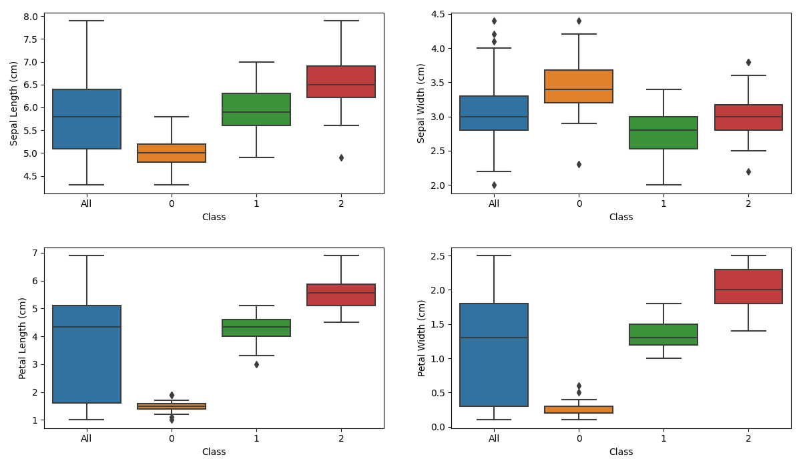
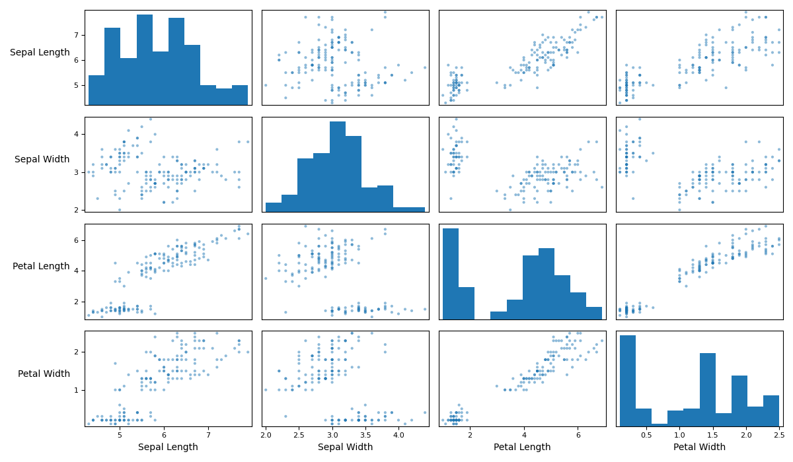
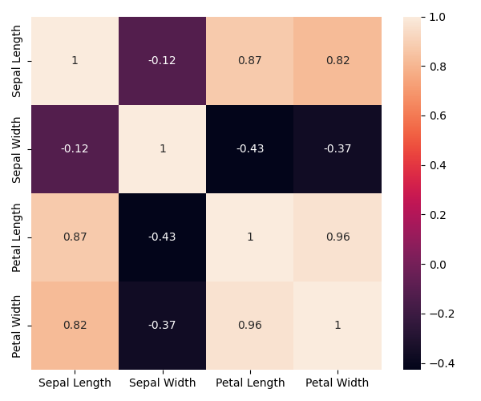
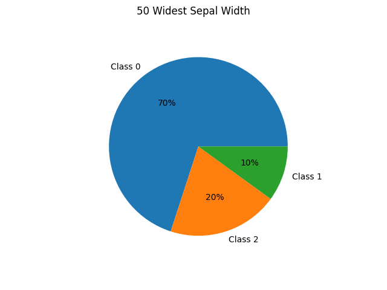
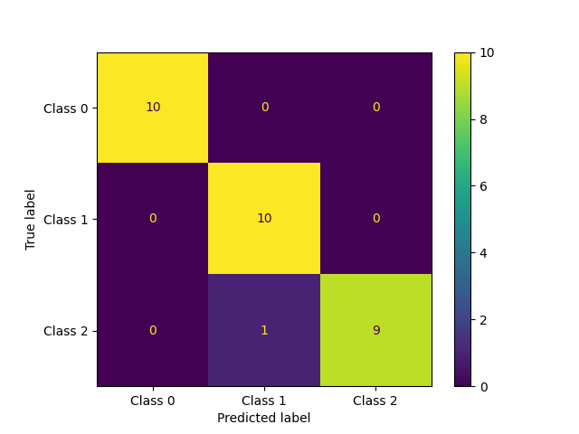

# ML Play
In this series of scripts we experiment with various machine learning (ML) techniques using Python.

This project is licensed under the terms of the MIT license.

## Content Overview
### `iris_eda.py`
In this script we read the well-known iris dataset available with sklearn.datasets and perform preliminary analyses and visualizations.  We start by getting used to the sklearn.datasets functionality and learning how to create a pandas data frame from the iris dataset.  This dataset consists of information on 150 flowers of three classes (with 50 flowers per class).  For each flower, the data includes petal and sepal length and width (in centimeters).  

In our analysis we create a series of box and whisker plots for each feature, with one plot for the combined data and one each for each class.

To understand how the different factors may be related, we make a scatterplot of each pair of factors and a histogram for each individual factor.  To accomplish this, we make use of pandas’ built in plotting functionality.  

Because the dataset consists of only 150 elements the resulting scatterplots are not very dense.  Reading trends may be easier, in this case, using a correlation matrix.  We use a heatmap to visualize the correlation between factors.

From the heatmap we observe sepal width has little correlation with any other factor but sepal length, petal length, and petal width demonstrate more significant correlation.  Further, petal length and petal width are closely correlated.

We conclude by examining those flowers which have the higher values for a particular factor.  For instance, using a pie chart we see that the class breakdown of the 50 flowers with the greatest sepal width is dominated by class 0.

 

### `dtree_demo.py`
In this script we provide a simple example of implementing a decision tree with sklearn. The iris dataset is split into a training and testing portion at an 8:2 ratio. The decision tree uses the quantatative factors (sepal and petal width and height) to predict the class of a flower. We manually input a few test predictions to verify how the classifier implementation works.  Once satisfied, we predict the classes of the test flowers and compare versus their true labels with a confusion matrix.  

The cell in the (i,j) ((row,column)) position contains the number of flowers which were predicted to be of class j, but were actually of class i.  The entries along the main diagonal thus represent correct predictions.

### `kfold_demo.py`
In this script we provide a minimal example of obtaining cross validation scores using `StratifiedKFold` from `sklearn.model_selection`. 

### `model-tuning`
This folder will contain various experiments with hyperparameter tuning for classfiers along with other attempts to improve prediction accuracy for classification and regression models.

## Dependencies
The following python libraries are used in this project.
* `pandas`
* `matplotlib`
* `seaborn`
* `sklearn`
